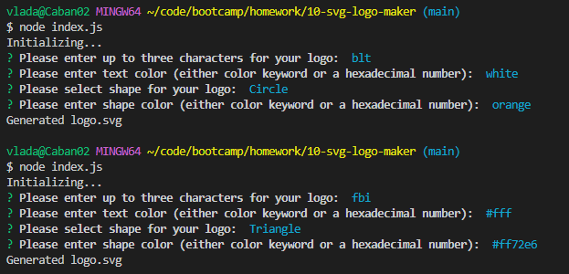

# SVG Logo Maker
  

  ## Description 

  Command-line application to generates SVG Logo based on user input. 

  ## Table of Contents

- [Installation](#installation)
- [Usage](#usage)
- [Test](#test)
- [Questions](#questions)
- [License](#license)

## Installation

To install necessary dependencies, run the following command:

```npm i```

## Usage

Used for generating SVG logo based on user input per below two examples. Color can be either a color keyword or a hexadecimal number.



Link to the walkthrough video: [follow the link]()

Example of generated logos: [link inside the repo](./examples/)

## Test

To test, run the following command:

```npm run test```

## Questions
GitHub profile: [vlada-caban](https://github.com/vlada-caban)

## License 
  License: MIT